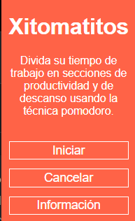
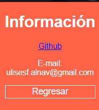
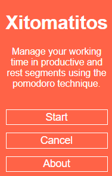
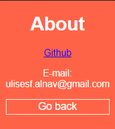
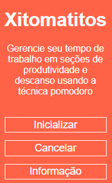
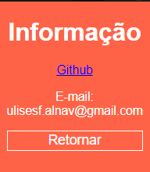

# xitomatitos

## ES

Una extensión que mediante la técnica pomodoro divide su tiempo de trabajo en tiempos de productividad y descanso: 25 min. de trabajo, seguidos de un periodo de descanso de 5 min; el cuarto periodo de descanso será más largo, de 15 min.

 

Haz clic en el botón de OK de la notificación para que el tiempo empiece a correr.

Por ahora, solo ha sido probado en chrome.

## EN

An extension that uses the pomodoro technique to manage your working time in periods of work and rest: 25 min. of work time, followed
by 5 minutes of rest; the fourth resting period will be longer: 15 min.

 

Click the notification's OK button to start the counting down of time.

For now, it has only been tested in chrome.

## PT

Uma extensão que usa a técnica pomodoro para dividir seu tempo de trabalho en tiempos de produtividade e descanso: 25 min. de trabalho, seguidos de um período de descanso de 5 min; o quarto período de descanso será mais longo, de 15 min.

 

Clique no botão OK da notificação para que o contagem de tempo comece.

Pelo momento, só tem sido testado no chrome.
